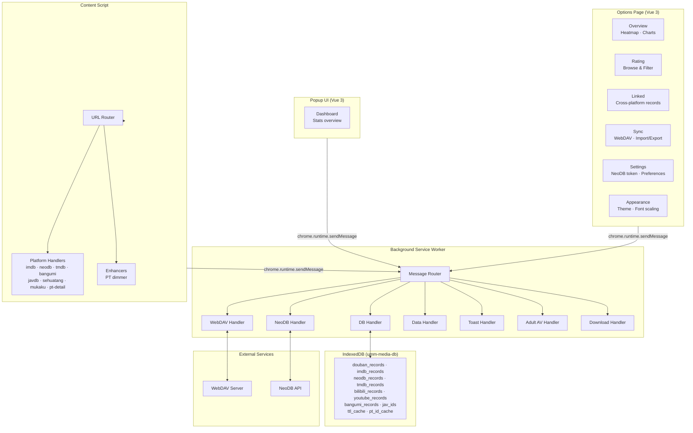

<p align="center">
  <a href="README.md"></a>
</p>

<p align="center">
  
</p>

<h1 align="center">UMM — Unified Multimedia Manager</h1>

<p align="center">
  <a href="https://github.com/UnforgetMemory/um-multimedia-manager/releases"></a>
  <a href="https://developer.chrome.com/docs/extensions/mv3/"></a>
  <a href="https://developer.chrome.com/docs/extensions/mv3/"></a>
  <a href="LICENSE"></a>
  <a href="https://ko-fi.com/unforgetmemory"></a>
</p>

<p align="center">
  <b>A Chrome extension that unifies your media tracking across Douban, IMDb, NeoDB, TMDB, private trackers, and BT sites — with cross-platform sync, automatic torrent dimming, and WebDAV backup.</b>
</p>

<p align="center">
  <sub>Built with Vue 3 · TypeScript · WXT · Tailwind CSS v4</sub>
</p>

---

## Features

| | |
|---|---|
| 🎯 **Cross-Platform Marking** | One-click status and rating on Douban, IMDb, NeoDB, TMDB, Bangumi, Bilibili, and YouTube pages |
| 🔗 **ID Linking** | Auto-map IDs across platforms — one record, all platforms |
| 🌙 **PT/BT Auto-Dimming** | Gray out watched torrents on supported private trackers and the Mukaku BT site |
| 📦 **WebDAV Backup** | Auto-backup to any WebDAV server, plus ZIP export/import |
| 🧩 **NeoDB Integration** | Pull ratings and push scores via NeoDB API |
| 🎨 **Theme Switching** | Light, dark, and system-following themes |
| 📊 **Statistics Dashboard** | Popup overview + full options page with heatmap, distribution, yearly stats, ratings |
| 🔞 **Adult Content Support** | Unified tracking for JavDB and Sehuatang |
| 🌐 **Internationalization** | Multi-language support (Chinese, English) |

## Supported Sites

| Category | Sites |
|---|---|
| Film & TV | `movie.douban.com` `imdb.com` `neodb.social` `themoviedb.org` `bgm.tv` `bangumi.tv` `chii.in` `bilibili.com` `youtube.com` |
| Music | `music.douban.com` `neodb.social/album` |
| Books | `book.douban.com` |
| Games | `game.douban.com` |
| Private Trackers | M-Team, Audiences, HDHome, HDArea, OurBits, PTerClub, PTHome, Haidan, Ptsbao, BTSchool, Discfan, HhanClub, HDDolby, HDFans, SoulVoice, HDTime, Piggo |
| BitTorrent | Mukaku (`web5.mukaku.com`, watched-video dimming) |
| Adult | JavDB, Sehuatang |

## Quick Start

```bash
git clone https://github.com/UnforgetMemory/um-multimedia-manager.git
cd um-multimedia-manager
npm install
npm run build
```

Load `dist/chrome-mv3` into Chrome via `chrome://extensions/` (Developer mode).

## Contributing

- **Report issues** — Open a GitHub issue for bugs or feature requests
- **Submit PRs** — Fork the repo, create a feature branch, and open a pull request
- **Translate** — Help improve or add language support
- **Test** — Write or improve Playwright E2E tests

Run `npm run type-check` and `npm run build` before committing — type checking and the build are the project's quality gates.

---

## Architecture



### Key Components

- **Background Service Worker** (`src/entrypoints/background.ts` + `src/entrypoints/background/handlers/`) — Central message router. All IndexedDB access, WebDAV sync, NeoDB API calls, file downloads, and alarm-based periodic tasks flow through this layer. Handlers are split by domain (db, webdav, neodb, data, toast, adult-av, download).
- **Content Script** (`src/entrypoints/content.ts` + `src/entrypoints/content/`) — Injected into matched pages. The URL router dispatches to the correct platform handler (IMDb, NeoDB, TMDB, Bangumi, JavDB, Sehuatang, Mukaku, PT detail pages). Enhancers add PT dimming.
- **Options Page** (`src/entrypoints/options/`) — Full Vue 3 app with sidebar layout. Six tabs: Overview (stats, heatmap, charts), Rating (browse & filter), Linked (cross-platform records), Sync (WebDAV + import/export), Settings (NeoDB token, preferences), and Appearance (theme, font scaling).
- **Popup Dashboard** (`src/entrypoints/popup/`) — Compact Vue 3 dashboard showing key statistics. Acts as a launch point to the options page.
- **Douban Content** (`src/content/douban/`) — Page-specific Vue apps rendered inside a Shadow DOM overlay for 32 Douban page types (movie/music/book/game detail, search, homepage, genre, doulists, user profiles, and more). Each page type gets its own component tree, data/config modules, and stylesheet.
- **PT Dimmer** (`src/entrypoints/content/enhancers/pt/`) — Modular dimmer system with per-site config, TTL cache, and NexusPHP/M-Team support. Scans PT pages, matches against watched IDs, and dims rows.
- **Video Overlay** (`src/entrypoints/content/ui/`) — Shared video overlay used by the Bilibili and YouTube content scripts (`video-overlay.ts` plus pure/tracker/styles helpers), alongside the check-viewed, doulist-replace, and manual-add panel modules.
- **Domain Layer** (`src/domain/`) — DDD-style domain entities: `Identity`, `Platform`, `MediaType`, `StoreRecord`, `Rating`, `Status`, and their repositories.
- **Data Layer** (`src/features/database/`) — IndexedDB manager with per-platform object stores, composite keys (`type::providerId`), cross-platform `linkedIds`, and schema version migration.
- **Shared Components** (`src/shared/`) — Reusable Vue components: StatCard, HeatmapCalendar, PlatformDistribution, ToastContainer, ConfirmDialog, plus shadcn/vue UI primitives (Button, Card, Dialog, Select, Switch, Tooltip, etc.).

---

## Installation

### Requirements

- **Node.js** >= 22
- **npm** >= 10
- **Chrome** >= 88

### Build from Source

```bash
# Clone the repository
git clone <repo-url>
cd um-multimedia-manager

# Install dependencies
npm install

# Build the extension
npm run build
```

Build output goes to `dist/chrome-mv3/`.

### Load into Chrome

1. Open Chrome and go to `chrome://extensions/`
2. Enable **Developer mode** (toggle in the top-right corner)
3. Click **Load unpacked**
4. Select the `dist/chrome-mv3/` directory

> Note: This project uses WXT, so the build output is in `dist/chrome-mv3/`, not a top-level `dist/`.

### Package for Distribution

```bash
npm run zip
```

Creates a `.zip` file ready for Chrome Web Store submission.

---

## Usage Guide

### Floating Panel

Visit any supported page (e.g., Douban movie, IMDb title, NeoDB item). A floating panel appears in the top-right corner.

- **Drag** the panel to reposition it.
- **Minimize** to collapse, **Close** to dismiss.
- **Status buttons**: Done, Wish, or Clear to set the watch status.
- **Rating slider**: Adjust from 0 to 10 in 0.5 steps.
- **Save** to persist the record.

The panel auto-detects the page and cross-references your existing records. If the item is already linked on another platform, it shows the linked status.

### PT Site Dimmer

When browsing supported PT sites, any torrent matching a watched item in your database is automatically dimmed. It works with dynamically loaded content (infinite scroll, pagination) and updates in real time when you mark new items.

### Popup Dashboard

Click the UMM icon in the Chrome toolbar to open the popup. It shows total records, platform distribution, and recent activity. Click **Open Options Page** for the full management interface.

### Options Page

| Tab | Description |
|-----|-------------|
| **Overview** | Total records, GitHub-style heatmap, daily/weekly activity charts, platform distribution |
| **Rating** | Browse and filter records by rating and source platform |
| **Linked** | View and manage cross-platform linked records |
| **Sync** | WebDAV backup/restore and ZIP import/export |
| **Settings** | NeoDB token, general preferences |
| **Appearance** | Theme selection (light/dark/system), font scaling |

### Data Management

All records are stored locally in IndexedDB. No manual saving needed. Use the Sync tab to:

- **WebDAV Backup** — Upload data to your own server.
- **ZIP Export** — Download all records as an archive.
- **ZIP Import** — Restore from a previously exported archive.

---

## Configuration

### WebDAV (Cloud Backup)

1. Go to the **Sync** tab in the options page.
2. Enter your WebDAV server URL, username, and password.
3. Click **Test Connection** to verify.
4. Use **Backup Now** to upload, or **Restore** to download and merge.

Backups are stored as ZIP archives containing JSON data files with metadata.

### NeoDB Token

To enable automatic metadata fetching from NeoDB:

1. Go to [NeoDB settings](https://neodb.social/settings/developer/) and generate an API token.
2. Enter the token in the **Settings** tab.
3. The extension now fetches metadata and cover images automatically when you tag items.

### Theme

Choose **Light**, **Dark**, or **System** (follows OS preference) from the Appearance tab. The floating panel on content pages also respects the theme setting.

---

## Development

### Setup

```bash
npm install
```

### Dev Mode (Hot Reload)

```bash
npm run dev
```

Starts the WXT dev server with hot module replacement. Load the unpacked extension from the output directory.

### Commands

| Command | Description |
|---------|-------------|
| `npm run dev` | Start dev server with HMR |
| `npm run build` | Build for production (Chrome MV3) |
| `npm run build:dev` | Dev build to `dist-dev/chrome-mv3-dev/` with a `(DEV)` marker |
| `npm run zip` | Build and create `.zip` for distribution |
| `npm run type-check` | TypeScript type checking via vue-tsc |
| `npm test` | Run Playwright tests (Chromium) |
| `npm run test:unit` | Run unit tests only |
| `npm run test:ui` | Launch Playwright UI mode |
| `npm run unpack` | Unpack the built extension |
| `npm run ds:check` | Design-token consistency check |
| `npm run package:patch` | Bump patch version, build, and package |
| `npm run package:minor` | Bump minor version, build, and package |
| `npm run package:major` | Bump major version, build, and package |
| `npm run data:export` | CLI data export |
| `npm run data:import` | CLI data import |
| `npm run deps:check` | Check outdated dependencies |
| `npm run deps:update` | Update dependencies |
| `npm run deps:audit` | npm audit |
| `npm run i18n:check` | Check i18n key coverage |

### Build Gotcha

`npm run build` runs `wxt build && node scripts/fix-paths.js`. The `fix-paths.js` post-step is required — the extension breaks without it. Build output goes to `dist/chrome-mv3/` (Chrome) or `dist/firefox-mv2/` (Firefox).

---

## Project Structure

```
um-multimedia-manager/
├── wxt.config.ts                    # WXT build configuration (Manifest V3)
├── components.json                  # shadcn/vue component configuration
├── tsconfig.json                    # TypeScript configuration
├── tsconfig.node.json               # Node-side TypeScript configuration
├── playwright.config.ts             # Playwright E2E test configuration
├── icons/                           # Extension icons (16/48/128 px)
│   ├── icon-16.png
│   ├── icon-48.png
│   └── icon-128.png
├── src/
│   ├── entrypoints/                 # WXT entry points
│   │   ├── background.ts            # Service Worker entry: message routing, alarms, notifications
│   │   ├── background/              # Service Worker support
│   │   │   └── handlers/            # Per-domain message handlers
│   │   │       ├── adult-av.ts      # Adult video operations
│   │   │       ├── data.ts          # Data CRUD operations
│   │   │       ├── db.ts            # IndexedDB operations
│   │   │       ├── download.ts      # File download operations
│   │   │       ├── neodb.ts         # NeoDB API proxy
│   │   │       ├── toast.ts         # Toast notification dispatch
│   │   │       └── webdav.ts        # WebDAV sync/backup/restore
│   │   ├── content.ts               # Content script entry: lazy init, URL matching, router dispatch
│   │   ├── content/                 # Content script modules
│   │   │   ├── router.ts            # URL → handler dispatch
│   │   │   ├── neodb-push.ts        # NeoDB push from content script
│   │   │   ├── handlers/            # Per-platform page handlers
│   │   │   │   ├── imdb.ts          # IMDb
│   │   │   │   ├── neodb.ts         # NeoDB
│   │   │   │   ├── neodb-sync.ts    # NeoDB sync decision logic
│   │   │   │   ├── tmdb.ts          # TMDB
│   │   │   │   ├── bangumi.ts       # Bangumi
│   │   │   │   ├── bangumi-list.ts  # Bangumi list pages
│   │   │   │   ├── bangumi-extract.ts      # Bangumi DOM extraction
│   │   │   │   ├── bangumi-list-extract.ts # Bangumi list DOM extraction
│   │   │   │   ├── mukaku/          # Mukaku BT site dimmer (config/dom/api/cache/handler)
│   │   │   │   ├── pt-detail.ts     # PT detail page ID extraction
│   │   │   │   ├── javdb.ts         # JavDB
│   │   │   │   ├── sehuatang.ts     # Sehuatang
│   │   │   │   └── create-detail-handler.ts  # Shared detail-handler factory
│   │   │   ├── enhancers/           # Content page enhancements
│   │   │   │   └── pt/              # PT dimmer system
│   │   │   │       ├── index.ts
│   │   │   │       ├── types.ts
│   │   │   │       ├── utils.ts
│   │   │   │       ├── config/
│   │   │   │       │   ├── index.ts
│   │   │   │       │   └── sites.ts
│   │   │   │       ├── dimmer/
│   │   │   │       │   ├── index.ts
│   │   │   │       │   ├── cache.ts
│   │   │   │       │   ├── mteam.ts
│   │   │   │       │   ├── mteam-match.ts
│   │   │   │       │   └── nexusphp.ts
│   │   │   │       └── scanner/
│   │   │   │           ├── index.ts
│   │   │   │           ├── queue.ts
│   │   │   │           └── semaphore.ts
│   │   │   ├── i18n/                # Content-script i18n (Shadow DOM-safe t())
│   │   │   │   ├── index.ts
│   │   │   │   └── locales.ts
│   │   │   ├── styles/              # Injected CSS
│   │   │   │   ├── global.ts
│   │   │   │   └── tokens.ts
│   │   │   ├── ui/                  # Content script UI modules
│   │   │   │   ├── video-overlay.ts # Shared video overlay (Bilibili/YouTube)
│   │   │   │   ├── video-overlay-pure.ts
│   │   │   │   ├── video-overlay-styles.ts
│   │   │   │   ├── video-overlay-tracker.ts
│   │   │   │   ├── check-viewed-panel.ts
│   │   │   │   ├── doulist-replace.ts
│   │   │   │   └── manual-add-panel.ts
│   │   │   └── utils/               # DOM and toast utilities
│   │   │       ├── dom.ts
│   │   │       └── toast.ts
│   │   ├── douban-early.content/    # Early Douban content script (Shadow DOM overlay)
│   │   │   └── index.ts
│   │   ├── douban-main.content/     # Main Douban content script (Vue apps)
│   │   │   └── index.ts
│   │   ├── bilibili.content/        # Bilibili video page content script
│   │   │   └── index.ts
│   │   ├── bilibili-homepage.content/  # Bilibili homepage content script
│   │   │   └── index.ts
│   │   ├── youtube-homepage.content/   # YouTube homepage content script
│   │   │   └── index.ts
│   │   ├── popup/                   # Popup UI (Vue 3)
│   │   │   ├── main.ts
│   │   │   ├── App.vue
│   │   │   ├── router.ts
│   │   │   ├── pages/
│   │   │   │   └── DashboardPage.vue
│   │   │   └── index.html
│   │   └── options/                 # Options page (Vue 3)
│   │       ├── main.ts
│   │       ├── App.vue
│   │       ├── router.ts
│   │       ├── constants.ts
│   │       ├── tabs/
│   │       │   ├── OverviewTab.vue
│   │       │   ├── RatingTab.vue
│   │       │   ├── LinkedTab.vue
│   │       │   ├── SettingsTab.vue
│   │       │   ├── AppearanceTab.vue
│   │       │   ├── SyncTab.vue
│   │       │   └── sync/
│   │       │       ├── WebDAVTab.vue
│   │       │       └── ImportExportTab.vue
│   │       └── index.html
│   ├── content/                     # Douban-specific content apps
│   │   └── douban/
│   │       ├── components/          # Douban shared components
│   │       ├── overlay/             # Shadow DOM overlay lifecycle
│   │       ├── pages/               # 32 per-page Vue apps
│   │       │   ├── detail/          # Movie/music/book/game detail page
│   │       │   ├── homepage/        # Douban homepage
│   │       │   ├── search/          # Search page
│   │       │   ├── genre/           # Genre listings
│   │       │   ├── doulists/        # Doulist pages
│   │       │   ├── user-media/      # User media collections
│   │       │   ├── user-profile/    # User profile
│   │       │   └── ...              # 32 page-specific apps total
│   │       ├── shared/              # Shared composables & helpers
│   │       │   ├── url-detector.ts  # Page type detection
│   │       │   ├── douban-extract.ts # Data extraction
│   │       │   ├── parse-douban-paginator.ts
│   │       │   ├── record-cache-core.ts
│   │       │   ├── status-labels.ts
│   │       │   ├── detail-ui.ts
│   │       │   ├── media-formats.ts
│   │       │   ├── legacy-bridge.ts # Reuses legacy content modules
│   │       │   └── composables/
│   │       │       ├── usePaginator.ts
│   │       │       └── useRecordCache.ts
│   │       └── styles/              # Douban-specific styles (per page type)
│   ├── domain/                      # Domain layer (DDD)
│   │   ├── identity/                # Identity value object & URL parser
│   │   ├── platform/                # Platform & MediaType enums
│   │   └── record/                  # StoreRecord, Rating, Status, RecordService
│   ├── features/                    # Business logic modules
│   │   ├── adult-av/                # Adult video ID recognition
│   │   ├── cache/                   # L1 memory LRU cache
│   │   ├── data-scheduler/          # Priority queue + rate limiting + retry
│   │   ├── database/                # IndexedDB models & CRUD
│   │   ├── migration/               # Schema migration
│   │   ├── neodb/                   # NeoDB API client
│   │   ├── optimistic-lock/         # Optimistic concurrency types
│   │   ├── settings/                # App settings
│   │   └── webdav/                  # WebDAV HTTP client
│   ├── shared/                      # Shared components
│   │   ├── StatCard.vue
│   │   ├── HeatmapCalendar.vue
│   │   ├── PlatformDistribution.vue
│   │   ├── ToastContainer.vue
│   │   ├── ConfirmDialog.vue
│   │   ├── identity.ts              # Platform identity helpers
│   │   ├── toast.ts                 # Toast helpers
│   │   ├── locales/                 # vue-i18n locales (en/zh-CN/zh-TW)
│   │   ├── plugins/                 # vue-i18n plugin setup
│   │   ├── styles/                  # Global styles & toast CSS
│   │   └── ui/                      # shadcn/vue UI primitives
│   │       ├── alert/
│   │       ├── badge/
│   │       ├── button/
│   │       ├── card/
│   │       ├── dialog/
│   │       ├── form-field/
│   │       ├── input/
│   │       ├── label/
│   │       ├── loading-button/
│   │       ├── nav-item/
│   │       ├── option-picker/
│   │       ├── platform-search-form/
│   │       ├── section-container/
│   │       ├── section-header/
│   │       ├── segmented-control/
│   │       ├── select/
│   │       ├── separator/
│   │       ├── setting-row/
│   │       ├── skeleton-loader/
│   │       ├── stats-grid/
│   │       ├── switch/
│   │       └── tooltip/
│   ├── stores/                      # Pinia state management
│   │   ├── app.ts                   # App-level state
│   │   ├── theme.ts                 # Theme state
│   │   ├── confirm.ts               # Confirm dialog state
│   │   └── index.ts
│   ├── composables/                 # Vue composables
│   │   ├── useStats.ts              # Stats computation
│   │   ├── usePlatformMeta.ts       # Platform metadata
│   │   ├── useToast.ts              # Toast notification system
│   │   └── useLocaleSync.ts         # Locale sync
│   ├── types/                       # TypeScript type definitions (messages, records)
│   │   └── index.ts
│   ├── config.ts                    # App config & storage keys
│   └── utils/                       # General utilities
│       ├── event-bus.ts             # Background → content broadcasting
│       ├── logger.ts                # Logging
│       ├── zip-utils.ts             # ZIP export/import helpers
│       ├── error-message.ts         # Error message formatting
│       ├── requestQueue.ts          # Request queue
│       ├── search-normalizer.ts     # Search normalization
│       └── ...                      # sleep/dateKey/escape-html/visibility etc.
├── scripts/                         # Build and packaging tools
│   ├── package.js                   # Version management & packaging
│   ├── unpack.js                    # Unpack extension
│   ├── fix-paths.js                 # Post-build path fixer
│   ├── resize-icons.ts              # Icon resizing
│   ├── data-export.js               # CLI data export
│   ├── data-import.js               # CLI data import
│   ├── add-umm-prefix.js            # UMM prefix helper
│   ├── check-i18n.js                # i18n coverage checker
│   └── archived/                    # Archived scripts (e.g. migrate-data.ts)
└── docs/                             # Additional documentation
```

---

## Tech Stack

| Layer | Technology |
|-------|-----------|
| **Framework** | Vue 3 (Composition API, `<script setup>`) |
| **Language** | TypeScript |
| **Build / Extension Framework** | WXT (Vite-powered, multi-browser) |
| **UI Components** | shadcn/vue (reka-ui primitives) |
| **Styling** | Tailwind CSS v4 |
| **Icons** | Lucide (via lucide-vue-next) |
| **State Management** | Pinia |
| **Internationalization** | vue-i18n |
| **Data Storage** | IndexedDB |
| **ZIP Handling** | fflate |
| **Testing** | Playwright |
| **Architecture** | Manifest V3 (Service Worker + Content Scripts + Popup) |
| **Dev Tools** | Vite, vue-tsc, TypeScript |

---

## License

This project is licensed under the Apache License, Version 2.0. See the [LICENSE](LICENSE) file for details.

---

<p align="center">
  <a href="https://ko-fi.com/unforgetmemory" target="_blank" rel="noopener">
    
  </a>
</p>

<p align="center">
  
  <br/>
  <em>Unify your media. Everywhere.</em>
</p>
