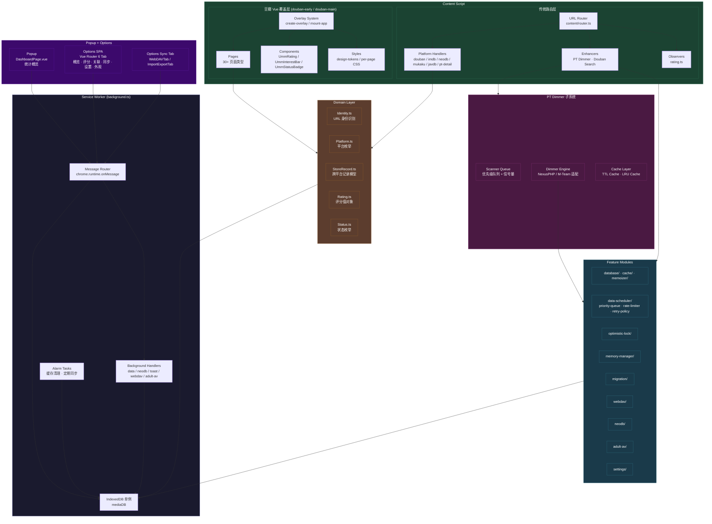

<p align="center">
  <a href="README.en.md"></a>
</p>

<p align="center">
  
</p>

<h1 align="center">UMM — 多媒体管理器</h1>

<p align="center">
  <a href="https://github.com/um-2023/um-multimedia-manager/releases"></a>
  <a href="https://developer.chrome.com/docs/extensions/mv3/"></a>
  <a href="https://developer.chrome.com/docs/extensions/mv3/"></a>
  <a href="https://nodejs.org/"></a>
  <a href="LICENSE"></a>
</p>

<p align="center">
  <b>UMM（UM Multimedia Manager）</b> 是一款 Manifest V3 Chrome 浏览器扩展，帮你统一管理豆瓣、IMDb、NeoDB、TMDB 等多平台的观影和收听记录。支持跨平台状态同步、PT 站点已看自动淡化、WebDAV 云端备份，让你的多媒体收藏井井有条。
</p>

<p align="center">
  <sub>Vue 3 · TypeScript · WXT · Tailwind CSS v4 · shadcn/vue</sub>
</p>

---

## 目录

- [功能特性](#功能特性)
- [支持的站点](#支持的站点)
- [技术栈](#技术栈)
- [架构](#架构)
- [安装](#安装)
- [使用指南](#使用指南)
- [配置](#配置)
- [开发](#开发)
- [项目结构](#项目结构)
- [贡献](#贡献)
- [许可](#许可)

---

## 功能特性

- **🎯 跨平台标记** — 在豆瓣（电影/音乐/书籍）、IMDb、NeoDB、TMDB 页面上通过悬浮面板一键标记状态和评分
- **🔗 ID 关联** — 自动建立豆瓣 ↔ IMDb ↔ NeoDB 的多平台 ID 映射，一份记录关联所有平台
- **🌙 PT 站点自动变暗** — 在 M-Team、Audiences、HDHome、HDArea、OurBits、PTerClub 等 PT 站点上，已标记的种子自动置灰淡化
- **🖌 新版豆瓣 Vue 覆盖层** — 基于 Vue 3 构建的豆瓣页面覆盖层系统，支持电影、书籍、音乐、游戏、人物等 30+ 种页面类型
- **📦 WebDAV 云端备份** — 支持 WebDAV 协议自动备份，同时提供 ZIP 格式的手动导出/导入
- **🧩 NeoDB API 集成** — 自动从 NeoDB 拉取评分和元数据，支持推送评分到 NeoDB
- **🎨 主题切换** — 亮色、暗色、跟随系统，三种主题自由切换
- **⚡ Service Worker 架构** — 后台 Service Worker 周期性同步、缓存清理，无需保持页面打开
- **📊 统计看板** — 弹出面板查看概览，独立选项页提供热力图、平台分布、评分管理、关联查询等功能
- **📝 丰富选项页** — 统计概览、活跃度热力图、平台分布、评分管理、关联查询、WebDAV 同步、主题定制
- **🔞 成人视频支持** — 识别并统一管理 JavDB、色花堂等平台的观看记录
- **🎨 设计系统** — 统一的设计 tokens、扩展排版系统和字体缩放，让界面更协调
- **⚙️ 数据调度与重试** — 内置优先级队列、速率限制和指数退避重试策略，保证后台任务可靠执行
- **🔒 乐观锁** — 基于版本号的乐观锁机制，防止并发修改导致的数据冲突
- **🧠 缓存与记忆管理** — TTL 缓存、LRU 缓存、数据备忘录模式，提升页面扫描和查询性能
- **🗂 数据迁移** — 内置迁移引擎，支持无障碍的 schema 版本演进
- **🌐 国际化** — 内容脚本多语言支持（中/英），覆盖 30+ 豆瓣页面类型

## 支持的站点

| 类型 | 站点 | 用途 |
|------|------|------|
| 影视平台 | `movie.douban.com` `imdb.com` `neodb.social` `themoviedb.org` | 观影标记与元数据 |
| 音乐平台 | `music.douban.com` `neodb.social/album` | 收听标记 |
| 书籍平台 | `book.douban.com` | 阅读标记 |
| 游戏平台 | `game.douban.com` | 游戏标记 |
| PT 站点 | M-Team、Audiences、HDHome、HDArea、OurBits、PTerClub、PTHome、Haidan、Ptsbao、BTSchool、Discfan、Hhanclub、HD Dolby、HDFans、SoulVoice、HDTime、Piggo | 已看种子自动淡化 |
| 成人视频 | JavDB、Sehuatang | 观看记录管理 |
| 其他 | `search.douban.com`、Mukaku | 搜索增强与记录同步 |

## 技术栈

| 技术 | 用途 |
|------|------|
| **Vue 3** (Composition API + `<script setup>`) | UI 框架 |
| **TypeScript** | 类型安全 |
| **WXT** | Chrome 扩展构建框架（基于 Vite） |
| **Tailwind CSS v4** | 样式方案 |
| **shadcn/vue** (reka-ui) | 组件库 |
| **Pinia** | 状态管理 |
| **VueUse** | Composition API 工具库 |
| **vue-router** | 选项页路由 |
| **vue-i18n** | 国际化 |
| **GSAP** | 动画引擎 |
| **Lucide** (lucide-vue-next) | 图标库 |
| **DOMPurify** | HTML 安全过滤 |
| **JSZip** | ZIP 打包与解包 |
| **IndexedDB** | 本地持久化存储 |
| **Playwright** | E2E 测试 |

## 架构



**核心流程：**

1. **Service Worker** 作为消息路由中心，所有跨上下文通信（Content ↔ Popup ↔ Options）经过 Message Router 转发。它持有唯一的 IndexedDB 连接，所有数据库操作均通过此层完成。
2. **Content Script** 采用双层架构：传统路由层按 URL 分发到各平台 Handler，而豆瓣站点使用全新的 Vue 覆盖层系统，通过 `douban-early.content` 和 `douban-main.content` 两个入口实现渐进式加载，覆盖 30+ 种页面类型。
3. **Popup 和 Options** 作为 Vue 3 SPA 应用，通过 `chrome.runtime.sendMessage` 与 Service Worker 通信。
4. **Domain Layer** 实现了领域驱动设计，包含 `Identity`（URL 身份识别）、`Platform`（平台枚举）、`StoreRecord`（跨平台记录模型）等核心领域对象。
5. **PT Dimmer** 子系统包含基于优先级队列和信号量的扫描引擎、NexusPHP/M-Team 适配器，以及 TTL+LRU 双层缓存。
6. **Feature Modules** 提供数据调度、乐观锁、缓存管理、内存管理等基础设施能力。

## 安装

### 从源码构建

```bash
# 克隆仓库
git clone <repo-url>
cd um-multimedia-manager

# 安装依赖
npm install

# 构建生产版本
npm run build
```

构建产物位于 `dist/chrome-mv3` 目录（Chrome）或 `dist/firefox-mv2`（Firefox）。

### 加载到 Chrome

1. 打开 Chrome 浏览器，访问 `chrome://extensions/`
2. 开启右上角的 **开发者模式**（Developer mode）
3. 点击 **加载已解压的扩展程序**（Load unpacked）
4. 选择项目的 `dist/chrome-mv3` 目录

> **注意**：构建后需运行 `node scripts/fix-paths.js` 修正路径（`npm run build` 已自动包含此步骤），否则扩展可能无法正常工作。

### 打包发布

```bash
npm run zip
```

生成 `.zip` 文件，可直接提交至 Chrome 网上应用店。

## 使用指南

### 快速标记

1. 访问支持的站点页面（如豆瓣电影 `movie.douban.com/subject/`）
2. 页面右上角自动出现悬浮面板
3. 点击 **已完成** / **想看** / **清除** 切换状态
4. 调整评分（0–10 星，步长 0.5）
5. 点击 **保存**

面板可拖拽位置，支持最小化和关闭。

### PT 站点淡化

在支持的 PT 站，已标记为"看过"的种子条目会自动变灰。淡化引擎：

- 支持动态加载内容（无限滚动、分页）
- 实时更新，新标记即时生效
- 使用 TTL 缓存（30 秒）+ LRU 缓存提升性能
- 通过 PT 详情页缓存和 ID 匹配双重保障

### 查看统计

点击浏览器工具栏的 UMM 图标，打开弹出面板：

- **统计概览** — 总记录数、各平台分布
- **搜索过滤** — 按标题、平台、状态快速定位
- **数据导出** — 一键导出 ZIP 备份文件

完整的统计分析在选项页中提供：

- **活跃度热力图** — GitHub 风格年度热力图
- **平台分布** — 各平台占比与趋势
- **评分管理** — 按评分和来源平台浏览筛选
- **关联查询** — 跨平台记录关联查看

### 数据管理

所有记录存储在本地 IndexedDB 中。可通过 WebDAV 备份到云端，或通过弹窗面板导出 ZIP 文件保存到本地。

## 配置

### WebDAV 备份

在选项页或弹窗的设置面板中配置：

| 字段 | 说明 |
|------|------|
| 服务器 URL | WebDAV 服务地址（如 `https://example.com/remote.php/dav/files/user/`）|
| 用户名 | WebDAV 登录用户名 |
| 密码 | WebDAV 密码或应用专用密码 |

支持坚果云、SourceForge 等常见 WebDAV 提供商。

### NeoDB API Token

如需启用 NeoDB 元数据增强和评分推送：

1. 登录 [NeoDB](https://neodb.social)
2. 进入个人设置页面生成 API Token
3. 填入扩展设置的对应字段

## 开发

### 环境要求

- Node.js >= 22
- npm >= 10
- Chrome >= 88（开发推荐）

### 开发模式

```bash
npm run dev
```

WXT 开发服务器支持热模块替换，代码改动自动同步到浏览器中已加载的扩展。

### 常用命令

| 命令 | 说明 |
|------|------|
| `npm run dev` | 启动开发模式（热更新） |
| `npm run build` | 构建生产版本（含路径修正） |
| `npm run zip` | 构建并打包为 `.zip` |
| `npm run type-check` | TypeScript 类型检查（`vue-tsc --noEmit`）|
| `npm test` | 运行 Playwright E2E 测试 |
| `npm run test:unit` | 运行单元测试 |
| `npm run test:integration` | 运行集成测试 |
| `npm run test:ui` | 启动 Playwright UI 测试模式 |
| `npm run package:patch` | 发布补丁版本（+ 构建） |
| `npm run package:minor` | 发布小版本（+ 构建） |
| `npm run package:major` | 发布大版本（+ 构建） |
| `npm run data:export` | 命令行导出数据 |
| `npm run data:import` | 命令行导入数据 |
| `npm run deps:audit` | 依赖安全审计 |
| `npm run deps:check` | 检查过期依赖 |
| `npm run deps:update` | 更新依赖 |
| `npm run resize-icons` | 调整扩展图标尺寸 |
| `npm run clean` | 清理构建产物和依赖 |
| `npm run i18n:check` | 检查国际化覆盖 |
| `npm run preview` | 预览构建产物 |

## 项目结构

```
um-multimedia-manager/
├── wxt.config.ts                    # WXT 扩展构建配置
├── components.json                  # shadcn/vue 组件配置
├── tsconfig.json                    # TypeScript 配置
├── playwright.config.ts             # Playwright E2E 测试配置
├── icons/                           # 扩展图标 (16/48/128px)
│
├── src/
│   ├── entrypoints/                 # WXT 入口点
│   │   ├── background.ts            # Service Worker（消息路由 + DB + 告警）
│   │   ├── background/handlers/     # 后台消息处理器
│   │   │   ├── data.ts              #   数据查询处理
│   │   │   ├── neodb.ts             #   NeoDB 推送
│   │   │   ├── webdav.ts            #   WebDAV 同步
│   │   │   ├── toast.ts             #   通知处理
│   │   │   └── adult-av.ts          #   成人视频处理
│   │   ├── content.ts               # Content Script 主入口（懒加载路由）
│   │   ├── content/                 # Content Script 业务逻辑
│   │   │   ├── router.ts            #   URL 路由分发
│   │   │   ├── handlers/            #   各平台处理器
│   │   │   │   ├── douban.ts        #     豆瓣入口
│   │   │   │   ├── douban-scanner.ts#     豆瓣页面扫描
│   │   │   │   ├── douban-sync/     #     豆瓣保存同步（sync-db / neodb / cross-platform）
│   │   │   │   ├── douban-neodb.ts  #     豆瓣 NeoDB 推送
│   │   │   │   ├── douban-toast.ts  #     豆瓣通知
│   │   │   │   ├── imdb.ts          #     IMDb
│   │   │   │   ├── neodb.ts         #     NeoDB
│   │   │   │   ├── mukaku.ts        #     Mukaku 同步
│   │   │   │   ├── pt-detail.ts     #     PT 详情页 ID 提取
│   │   │   │   ├── javdb.ts         #     JavDB
│   │   │   │   └── sehuatang.ts     #     色花堂
│   │   │   ├── enhancers/           #   页面增强功能
│   │   │   │   ├── douban-search.ts #     豆瓣搜索增强
│   │   │   │   └── pt/              #     PT 淡化子系统
│   │   │   │       ├── config/      #       站点配置
│   │   │   │       ├── dimmer/      #       淡化引擎（cache / mteam / nexusphp）
│   │   │   │       └── scanner/     #       扫描队列（queue / semaphore）
│   │   │   ├── observers/           #   页面状态观察者
│   │   │   │   └── rating.ts        #     评分变化监听
│   │   │   ├── i18n/                #   国际化
│   │   │   ├── styles/              #   注入样式
│   │   │   └── utils/               #   工具函数
│   │   ├── douban-early.content/    # 豆瓣早期注入（预加载 overlay 样式）
│   │   │   ├── index.ts
│   │   │   └── overlay.css
│   │   ├── douban-main.content/     # 豆瓣主注入（Vue 覆盖层应用）
│   │   │   └── index.ts
│   │   ├── popup/                   # 弹窗 UI（Vue 3 SPA）
│   │   │   ├── main.ts
│   │   │   ├── App.vue
│   │   │   ├── router.ts
│   │   │   └── pages/
│   │   │       └── DashboardPage.vue
│   │   └── options/                 # 选项页 UI（Vue 3 SPA）
│   │       ├── main.ts
│   │       ├── App.vue
│   │       ├── router.ts
│   │       ├── tabs/
│   │       │   ├── OverviewTab.vue    # 统计概览 + 热力图
│   │       │   ├── RatingTab.vue      # 评分管理
│   │       │   ├── LinkedTab.vue      # 关联查询
│   │       │   ├── SyncTab.vue        # WebDAV 同步 + 导入导出
│   │       │   │   ├── WebDAVTab.vue
│   │       │   │   └── ImportExportTab.vue
│   │       │   ├── SettingsTab.vue    # 配置
│   │       │   └── AppearanceTab.vue  # 外观定制
│   │       └── index.html
│   │
│   ├── content/                     # 新版豆瓣覆盖层系统
│   │   └── douban/
│   │       ├── early.ts             #   早期注入逻辑
│   │       ├── main.ts              #   主应用入口
│   │       ├── overlay.ts           #   覆盖层管理器
│   │       ├── overlay/             #   覆盖层创建与挂载
│   │       │   ├── create-overlay.ts
│   │       │   ├── mount-app.ts
│   │       │   ├── dismiss.ts
│   │       │   ├── theme-sync.ts
│   │       │   └── index.ts
│   │       ├── page-registry.ts     #   页面类型注册表
│   │       ├── css-composer.ts      #   CSS 合成器
│   │       ├── css-map.ts           #   CSS 映射表
│   │       ├── pages/               #   30+ 页面类型覆盖
│   │       │   ├── detail/          #     影视详情
│   │       │   ├── homepage/        #     首页
│   │       │   ├── movie-profile/   #     电影个人页
│   │       │   ├── search/          #     搜索
│   │       │   ├── genre/           #     分类
│   │       │   ├── celebrities/     #     影人
│   │       │   ├── user-profile/    #     用户主页
│   │       │   ├── user-media/      #     用户收藏
│   │       │   ├── user-reviews/    #     用户评论
│   │       │   ├── user-celebrities/#     用户影人关注
│   │       │   ├── review-detail/   #     评论详情
│   │       │   ├── photos/          #     剧照
│   │       │   ├── trailer/         #     预告片
│   │       │   ├── doulist-detail/  #     豆列详情
│   │       │   ├── doulists/        #     豆列列表
│   │       │   ├── book-profile/    #     书籍详情
│   │       │   ├── book-homepage/   #     读书首页
│   │       │   ├── book-collect/    #     读书收藏
│   │       │   ├── book-reviews/    #     书评列表
│   │       │   ├── book-review-detail/#    书评详情
│   │       │   ├── book-authors/    #     作者
│   │       │   ├── music-homepage/  #     音乐首页
│   │       │   ├── albums/          #     专辑
│   │       │   ├── artists-overview/#     音乐人概览
│   │       │   ├── game-detail/     #     游戏详情
│   │       │   ├── game-collect/    #     游戏收藏
│   │       │   ├── game-explore/    #     游戏探索
│   │       │   ├── personage/       #     人物
│   │       │   └── ...
│   │       ├── components/          #   豆瓣覆盖层组件
│   │       │   ├── UmmRating.vue        #     评分组件
│   │       │   ├── UmmInterestBar.vue   #     想看/看过切换
│   │       │   ├── UmmStatusBadge.vue   #     状态徽章
│   │       │   ├── UmmMediaCard.vue     #     媒体卡片
│   │       │   ├── UmmDynamicIsland.vue #     动态岛提示
│   │       │   ├── UmmPageLayout.vue    #     页面布局
│   │       │   ├── UmmUserBar.vue       #     用户栏
│   │       │   ├── UmmStatBar.vue       #     统计栏
│   │       │   ├── UmmPaginator.vue     #     分页器
│   │       │   └── ...
│   │       ├── shared/              #   共享逻辑
│   │       │   ├── extract-subject-id.ts
│   │       │   ├── load-record-map.ts
│   │       │   ├── url-detector.ts
│   │       │   ├── theme-sync.ts
│   │       │   ├── hide-nav.ts
│   │       │   ├── composables/
│   │       │   └── constants.ts
│   │       ├── styles/              #   逐页类型 CSS（30+ 文件）
│   │       │   ├── design-tokens.css
│   │       │   ├── base.css
│   │       │   ├── detail.css
│   │       │   ├── homepage.css
│   │       │   ├── breakpoints.css
│   │       │   ├── theme.css
│   │       │   └── ...
│   │       └── mount-factory.ts     #   Vue 应用工厂
│   │
│   ├── domain/                      # 领域层（DDD）
│   │   ├── identity/
│   │   │   ├── Identity.ts          #   URL 身份识别
│   │   │   ├── IdentityFactory.ts   #   身份工厂
│   │   │   └── IIdentityRepository.ts
│   │   ├── platform/
│   │   │   ├── Platform.ts          #   平台枚举
│   │   │   └── MediaType.ts         #   媒体类型
│   │   └── record/
│   │       ├── StoreRecord.ts       #   跨平台记录模型
│   │       ├── RecordService.ts     #   记录服务
│   │       ├── Status.ts            #   状态枚举
│   │       ├── Rating.ts            #   评分值对象
│   │       └── IRecordRepository.ts
│   │
│   ├── features/                    # 业务功能模块
│   │   ├── database/                #   IndexedDB 持久化
│   │   │   ├── models.ts            #     数据模型与存储定义
│   │   │   ├── api.ts               #     CRUD 操作
│   │   │   └── query-utils.ts       #     查询工具
│   │   ├── cache/                   #   缓存层
│   │   │   ├── cache-manager.ts
│   │   │   ├── lru-cache.ts
│   │   │   └── ttl-cache-store.ts
│   │   ├── data-scheduler/          #   数据调度
│   │   │   ├── data-scheduler.ts
│   │   │   ├── priority-queue.ts
│   │   │   ├── rate-limiter.ts
│   │   │   ├── retry-policy.ts
│   │   │   ├── scheduler-monitor.ts
│   │   │   └── types.ts
│   │   ├── memoizer/                #   数据备忘录
│   │   ├── optimistic-lock/         #   乐观锁
│   │   ├── memory-manager/          #   内存管理
│   │   ├── migration/               #   数据迁移
│   │   ├── identity/                #   URL 身份识别（旧版适配层）
│   │   ├── settings/                #   缓存设置
│   │   ├── neodb/                   #   NeoDB API 客户端
│   │   ├── webdav/                  #   WebDAV 客户端
│   │   └── adult-av/                #   成人视频识别与存储
│   │
│   ├── stores/                      # Pinia 状态管理
│   │   ├── app.ts                   #   应用级状态
│   │   ├── theme.ts                 #   主题状态
│   │   └── confirm.ts               #   确认对话框状态
│   │
│   ├── composables/                 # Vue composables
│   │   ├── useStats.ts              #   统计数据计算
│   │   ├── usePlatformMeta.ts       #   平台元信息
│   │   ├── useToast.ts              #   通知系统
│   │   └── useLocaleSync.ts         #   语言同步
│   │
│   ├── shared/                      # 跨入口点共享模块
│   │   ├── stores/                  #   共享状态
│   │   ├── composables/             #   共享 composables
│   │   ├── components/              #   共享组件（StatCard / HeatmapCalendar / ToastContainer 等）
│   │   ├── ui/                      #   shadcn/vue 组件
│   │   ├── styles/                  #   共享样式
│   │   ├── utils/                   #   共享工具函数
│   │   ├── types/                   #   共享类型定义
│   │   ├── plugins/                 #   Vue 插件
│   │   ├── locales/                 #   国际化资源
│   │   └── identity.ts              #   共享身份识别
│   │
│   ├── components/                  # 通用组件（旧版引用）
│   ├── styles/                      # 全局样式
│   │   ├── design-tokens.css        #   设计系统变量
│   │   └── typography.css           #   排版系统
│   ├── types/                       # TypeScript 类型定义
│   │   ├── index.ts
│   │   └── messages.ts              #   消息类型常量
│   ├── config.ts                    # 应用配置
│   └── utils/                       # 通用工具
│       ├── logger.ts                #   日志系统
│       ├── cn.ts                    #   classnames 工具
│       ├── event-bus.ts             #   事件总线
│       ├── requestQueue.ts          #   请求队列
│       ├── zip-utils.ts             #   ZIP 工具
│       ├── hash-utils.ts            #   哈希工具
│       ├── search-normalizer.ts     #   搜索标准化
│       ├── escape-html.ts           #   HTML 转义
│       └── context.ts               #   上下文工具
│
├── scripts/                         # 构建与维护脚本
│   ├── package.js                   #   版本管理与打包
│   ├── fix-paths.js                 #   构建后路径修正（必须）
│   ├── unpack.js                    #   解包扩展
│   ├── resize-icons.ts              #   图标尺寸调整
│   ├── data-export.js               #   CLI 数据导出
│   ├── data-import.js               #   CLI 数据导入
│   ├── migrate-data.ts              #   数据迁移工具
│   ├── check-i18n.js                #   国际化检查
│   └── add-umm-prefix.js            #   前缀添加工具
│
├── .omo/                            # 工作计划与规格文档
└── docs/                            # 附加文档
```

## 贡献

欢迎贡献！以下是参与方式：

- **报告问题** — 提交 Issue 描述 bug 或功能建议
- **代码贡献** — Fork 项目，创建特性分支，提交 PR
- **国际化** — 帮助我们完善或添加新的语言支持
- **测试** — 编写或改进 Playwright E2E 测试

代码风格方面，项目依赖 TypeScript 类型检查作为质量门禁，提交前请运行 `npm run type-check` 确保无类型错误。CI 流程为：类型检查 → 构建 → 测试。

## 许可

[Apache 2.0](LICENSE)

---

<p align="center">
  
  <br/>
  <em>把你的观影记录统一起来。</em>
</p>
