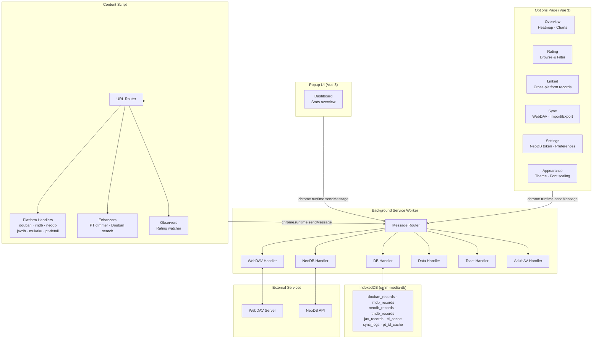

<p align="center">
  <a href="README.md"></a>
</p>

> 🏗️ This project is part of the **UM Multimedia Manager Monorepo**.  
> Browser extension module. See [root README](../../README.md) for full project documentation.

<p align="center">
  
</p>

<h1 align="center">UMM — UM Multimedia Manager</h1>

<p align="center">
  <a href="https://github.com/"></a>
  <a href="https://chrome.google.com/webstore"></a>
  <a href="https://developer.chrome.com/docs/extensions/mv3/"></a>
  <a href="https://vuejs.org/"></a>
  <a href="https://nodejs.org/"></a>
  <a href="LICENSE"></a>
</p>

<p align="center">
  <b>UMM</b> (<b>UM Multimedia Manager</b>, where <b>UM</b> stands for <b>UnforgetMemory</b>) is a Chrome extension (Manifest V3) that unifies your movie, TV, music, and book records across platforms. Mark something watched on one site and it syncs everywhere. PT site dimming, WebDAV backup, and full NeoDB integration included.
</p>

<p align="center">
  Built with <b>Vue 3</b> + <b>TypeScript</b> + <b>WXT</b> + <b>Tailwind CSS v4</b> + <b>shadcn/vue</b>.
</p>

---

## Features

- **Cross-Platform Tagging** — One-click floating panel on Douban (movie, music, book), IMDb, NeoDB, and TMDB. Mark as done, want-to-watch, or rate with a slider.
- **ID Linking** — Auto-connects Douban, IMDb, and NeoDB records for the same title. Tag it once, it syncs across all platforms.
- **PT Site Dimmer** — Visually dims already-watched torrents on supported PT sites (M-Team, Audiences, HDHome, HDArea, OurBits, PTerClub, and more). Works with dynamically loaded content.
- **WebDAV Cloud Backup** — Backup and restore your data to any WebDAV server. Also supports manual ZIP export and import.
- **NeoDB API Integration** — Fetches metadata and cover images from NeoDB automatically when you tag items.
- **Theme Support** — Light, dark, or system-following theme with smooth transitions.
- **Service Worker Architecture** — Background service worker handles IndexedDB, alarms, messaging, and periodic cache cleanup without keeping pages open.
- **Stats Dashboard** — Popup shows key statistics at a glance. Full options page provides a heatmap, platform distribution charts, rating management, and more.
- **Adult Video Support** — Recognize and manage watch records from JavDB, Sehuatang, and similar sources.
- **Design System** — Unified design tokens, typography scales, and font sizing for a consistent look.

---

## Supported Sites

| Category | Sites | Feature |
|----------|-------|---------|
| **Movie / TV** | Douban, IMDb, NeoDB, TMDB | Floating panel, status tagging, rating |
| **Music** | Douban Music, NeoDB | Tagging and rating |
| **Books** | Douban Book | Tagging and status |
| **PT Sites** | M-Team, Audiences, HDHome, HDArea, OurBits, PTerClub, PTHome, Haidan, Ptsbao, BTSchool, Discfan, HhanClub, HDDolby, HDFans, SoulVoice, HDTime, Piggo | Auto-dim watched torrents, ID extraction from detail pages |
| **Adult Video** | JavDB, Sehuatang | Watch record management |
| **Other** | Mukaku, Douban Search | Sync, search enhancement |

---

## Architecture



### Key Components

- **Background Service Worker** (`src/entrypoints/background/`) — Central message router. All IndexedDB access, WebDAV sync, NeoDB API calls, and alarm-based periodic tasks flow through this layer. Handlers are split by domain (db, webdav, neodb, data, toast, adult-av).
- **Content Script** (`src/entrypoints/content/`) — Injected into matched pages. The URL router dispatches to the correct platform handler. Enhancers add PT dimming and search enhancements. Observers watch for rating changes.
- **Options Page** (`src/entrypoints/options/`) — Full Vue 3 app with sidebar layout. Six tabs: Overview (stats, heatmap, charts), Rating (browse & filter), Linked (cross-platform records), Sync (WebDAV + import/export), Settings (NeoDB token, preferences), and Appearance (theme, font scaling).
- **Popup Dashboard** (`src/entrypoints/popup/`) — Compact Vue 3 dashboard showing key statistics. Acts as a launch point to the options page.
- **Douban Content** (`src/content/douban/`) — Page-specific Vue apps rendered for Douban pages (movie detail, search, homepage, user profiles, book pages, music, games, and more). Each page type gets its own component tree.
- **PT Dimmer** (`src/entrypoints/content/enhancers/pt/`) — Modular dimmer system with per-site config, TTL cache, and NexusPHP/M-Team support. Scans PT pages, matches against watched IDs, and dims rows.
- **Domain Layer** (`src/domain/`) — DDD-style domain entities: `Identity`, `Platform`, `MediaType`, `StoreRecord`, `Rating`, `Status`, and their repositories.
- **Data Layer** (`src/features/database/`) — IndexedDB manager with per-platform object stores, composite keys (`type::providerId`), cross-platform `linkedIds`, and schema version migration.
- **Shared Components** (`src/shared/`) — Reusable Vue components: StatCard, HeatmapCalendar, PlatformDistribution, ToastContainer, ConfirmDialog, plus shadcn/vue UI primitives (Button, Card, Dialog, Select, Switch, Tooltip, etc.).

---

## Installation

### Requirements

- **Node.js** >= 22
- **npm** >= 10
- **Chrome** >= 88

### Build from Source

```bash
# Clone the repository
git clone <repo-url>
cd um-multimedia-manager

# Install dependencies
npm install

# Build the extension
npm run build
```

Build output goes to `dist/chrome-mv3/`.

### Load into Chrome

1. Open Chrome and go to `chrome://extensions/`
2. Enable **Developer mode** (toggle in the top-right corner)
3. Click **Load unpacked**
4. Select the `dist/chrome-mv3/` directory

> Note: This project uses WXT, so the build output is in `dist/chrome-mv3/`, not a top-level `dist/`.

### Package for Distribution

```bash
npm run zip
```

Creates a `.zip` file ready for Chrome Web Store submission.

---

## Usage Guide

### Floating Panel

Visit any supported page (e.g., Douban movie, IMDb title, NeoDB item). A floating panel appears in the top-right corner.

- **Drag** the panel to reposition it.
- **Minimize** to collapse, **Close** to dismiss.
- **Status buttons**: Done, Wish, or Clear to set the watch status.
- **Rating slider**: Adjust from 0 to 10 in 0.5 steps.
- **Save** to persist the record.

The panel auto-detects the page and cross-references your existing records. If the item is already linked on another platform, it shows the linked status.

### PT Site Dimmer

When browsing supported PT sites, any torrent matching a watched item in your database is automatically dimmed. It works with dynamically loaded content (infinite scroll, pagination) and updates in real time when you mark new items.

### Popup Dashboard

Click the UMM icon in the Chrome toolbar to open the popup. It shows total records, platform distribution, and recent activity. Click **Open Options Page** for the full management interface.

### Options Page

| Tab | Description |
|-----|-------------|
| **Overview** | Total records, GitHub-style heatmap, daily/weekly activity charts, platform distribution |
| **Rating** | Browse and filter records by rating and source platform |
| **Linked** | View and manage cross-platform linked records |
| **Sync** | WebDAV backup/restore and ZIP import/export |
| **Settings** | NeoDB token, general preferences |
| **Appearance** | Theme selection (light/dark/system), font scaling |

### Data Management

All records are stored locally in IndexedDB. No manual saving needed. Use the Sync tab to:

- **WebDAV Backup** — Upload data to your own server.
- **ZIP Export** — Download all records as an archive.
- **ZIP Import** — Restore from a previously exported archive.

---

## Configuration

### WebDAV (Cloud Backup)

1. Go to the **Sync** tab in the options page.
2. Enter your WebDAV server URL, username, and password.
3. Click **Test Connection** to verify.
4. Use **Backup Now** to upload, or **Restore** to download and merge.

Backups are stored as ZIP archives containing JSON data files with metadata.

### NeoDB Token

To enable automatic metadata fetching from NeoDB:

1. Go to [NeoDB settings](https://neodb.social/settings/developer/) and generate an API token.
2. Enter the token in the **Settings** tab.
3. The extension now fetches metadata and cover images automatically when you tag items.

### Theme

Choose **Light**, **Dark**, or **System** (follows OS preference) from the Appearance tab. The floating panel on content pages also respects the theme setting.

---

## Development

### Setup

```bash
npm install
```

### Dev Mode (Hot Reload)

```bash
npm run dev
```

Starts the WXT dev server with hot module replacement. Load the unpacked extension from the output directory.

### Commands

| Command | Description |
|---------|-------------|
| `npm run dev` | Start dev server with HMR |
| `npm run build` | Build for production (Chrome MV3) |
| `npm run zip` | Build and create `.zip` for distribution |
| `npm run type-check` | TypeScript type checking via vue-tsc |
| `npm test` | Run Playwright tests (Chromium) |
| `npm run test:unit` | Run unit tests only |
| `npm run test:integration` | Run integration tests only |
| `npm run test:ui` | Launch Playwright UI mode |
| `npm run package:patch` | Bump patch version, build, and package |
| `npm run package:minor` | Bump minor version, build, and package |
| `npm run package:major` | Bump major version, build, and package |
| `npm run data:export` | CLI data export |
| `npm run data:import` | CLI data import |
| `npm run deps:audit` | npm audit |
| `npm run i18n:check` | Check i18n key coverage |

### Build Gotcha

`npm run build` runs `wxt build && node scripts/fix-paths.js`. The `fix-paths.js` post-step is required — the extension breaks without it. Build output goes to `dist/chrome-mv3/` (Chrome) or `dist/firefox-mv2/` (Firefox).

---

## Project Structure

```
um-multimedia-manager/
├── wxt.config.ts                    # WXT build configuration (Manifest V3)
├── components.json                  # shadcn/vue component configuration
├── tsconfig.json                    # TypeScript configuration
├── playwright.config.ts             # Playwright E2E test configuration
├── icons/                           # Extension icons (16/48/128 px)
│   ├── icon-16.png
│   ├── icon-48.png
│   └── icon-128.png
├── src/
│   ├── entrypoints/                 # WXT entry points
│   │   ├── background/              # Service Worker
│   │   │   ├── index.ts             # Entry: message routing, alarms, notifications
│   │   │   └── handlers/            # Per-domain message handlers
│   │   │       ├── adult-av.ts      # Adult video operations
│   │   │       ├── data.ts          # Data CRUD operations
│   │   │       ├── neodb.ts         # NeoDB API proxy
│   │   │       ├── toast.ts         # Toast notification dispatch
│   │   │       └── webdav.ts        # WebDAV sync/backup/restore
│   │   ├── content/                 # Content script (injected into pages)
│   │   │   ├── index.ts             # Main entry: lazy init, URL matching
│   │   │   ├── router.ts            # URL → handler dispatch
│   │   │   ├── neodb-push.ts        # NeoDB push from content script
│   │   │   ├── handlers/            # Per-platform page handlers
│   │   │   │   ├── douban.ts        # Douban entry point
│   │   │   │   ├── douban-scanner.ts # Douban page scanning
│   │   │   │   ├── douban-sync/     # Douban sync modules
│   │   │   │   │   ├── index.ts
│   │   │   │   │   ├── sync-cross-platform.ts
│   │   │   │   │   ├── sync-db.ts
│   │   │   │   │   └── sync-neodb.ts
│   │   │   │   ├── douban-neodb.ts  # Douban → NeoDB push
│   │   │   │   ├── douban-toast.ts  # Douban toast notifications
│   │   │   │   ├── imdb.ts          # IMDb
│   │   │   │   ├── neodb.ts         # NeoDB
│   │   │   │   ├── mukaku.ts        # Mukaku sync
│   │   │   │   ├── pt-detail.ts     # PT detail page ID extraction
│   │   │   │   ├── javdb.ts         # JavDB
│   │   │   │   └── sehuatang.ts     # Sehuatang
│   │   │   ├── enhancers/           # Content page enhancements
│   │   │   │   ├── douban-search.ts # Douban search enhancer
│   │   │   │   └── pt/              # PT dimmer system
│   │   │   │       ├── index.ts
│   │   │   │       ├── types.ts
│   │   │   │       ├── utils.ts
│   │   │   │       ├── config/
│   │   │   │       │   ├── index.ts
│   │   │   │       │   └── sites.ts
│   │   │   │       ├── dimmer/
│   │   │   │       │   ├── index.ts
│   │   │   │       │   ├── cache.ts
│   │   │   │       │   ├── mteam.ts
│   │   │   │       │   └── nexusphp.ts
│   │   │   │       └── scanner/
│   │   │   │           ├── index.ts
│   │   │   │           ├── queue.ts
│   │   │   │           └── semaphore.ts
│   │   │   ├── observers/           # Page state observers
│   │   │   │   └── rating.ts        # Rating change watcher
│   │   │   ├── i18n/                # Internationalization
│   │   │   │   ├── index.ts
│   │   │   │   └── locales.ts
│   │   │   ├── styles/              # Injected CSS
│   │   │   │   ├── global.ts
│   │   │   │   └── tokens.ts
│   │   │   ├── ui/                  # Content script UI panels
│   │   │   │   ├── check-viewed-panel.ts
│   │   │   │   ├── doulist-replace.ts
│   │   │   │   └── manual-add-panel.ts
│   │   │   └── utils/               # DOM and toast utilities
│   │   │       ├── dom.ts
│   │   │       └── toast.ts
│   │   ├── douban-early.content.ts  # Early Douban content script
│   │   ├── douban-main.content.ts   # Main Douban content script
│   │   ├── popup/                   # Popup UI (Vue 3)
│   │   │   ├── main.ts
│   │   │   ├── App.vue
│   │   │   ├── pages/
│   │   │   │   └── DashboardPage.vue
│   │   │   └── index.html
│   │   └── options/                 # Options page (Vue 3)
│   │       ├── main.ts
│   │       ├── App.vue
│   │       ├── router.ts
│   │       ├── tabs/
│   │       │   ├── OverviewTab.vue
│   │       │   ├── RatingTab.vue
│   │       │   ├── LinkedTab.vue
│   │       │   ├── SettingsTab.vue
│   │       │   ├── AppearanceTab.vue
│   │       │   └── sync/
│   │       │       ├── WebDAVTab.vue
│   │       │       └── ImportExportTab.vue
│   │       └── index.html
│   ├── content/                     # Douban-specific content apps
│   │   └── douban/
│   │       ├── components/          # Douban shared components
│   │       ├── overlay/             # Floating overlay components
│   │       ├── pages/               # Per-page Vue apps
│   │       │   ├── detail/          # Movie/music/book detail page
│   │       │   ├── homepage/        # Douban homepage
│   │       │   ├── search/          # Search page
│   │       │   ├── genre/           # Genre listings
│   │       │   ├── user-media/      # User media collections
│   │       │   ├── user-profile/    # User profile
│   │       │   └── ...              # 20+ page-specific apps
│   │       ├── shared/              # Shared composables
│   │       └── styles/              # Douban-specific styles
│   ├── domain/                      # Domain layer (DDD)
│   │   ├── identity/               # Identity value objects & repository
│   │   ├── platform/               # Platform & MediaType enums
│   │   └── record/                 # Record, Rating, Status, service, repository
│   ├── features/                    # Business logic modules
│   │   ├── adult-av/               # Adult video ID recognition
│   │   ├── cache/                  # Cache management
│   │   ├── data-scheduler/         # Periodic data tasks
│   │   ├── database/               # IndexedDB models & CRUD
│   │   ├── identity/               # URL identity parser
│   │   ├── memoizer/               # Function memoization
│   │   ├── memory-manager/         # Memory management utilities
│   │   ├── migration/              # Schema migration
│   │   ├── neodb/                  # NeoDB API client
│   │   ├── optimistic-lock/        # Optimistic concurrency control
│   │   ├── settings/               # App settings
│   │   └── webdav/                 # WebDAV HTTP client
│   ├── shared/                      # Shared components
│   │   ├── StatCard.vue
│   │   ├── HeatmapCalendar.vue
│   │   ├── PlatformDistribution.vue
│   │   ├── ToastContainer.vue
│   │   ├── ConfirmDialog.vue
│   │   └── ui/                     # shadcn/vue UI primitives
│   │       ├── alert/
│   │       ├── badge/
│   │       ├── button/
│   │       ├── card/
│   │       ├── dialog/
│   │       ├── form-field/
│   │       ├── input/
│   │       ├── label/
│   │       ├── loading-button/
│   │       ├── nav-item/
│   │       ├── option-picker/
│   │       ├── platform-search-form/
│   │       ├── section-container/
│   │       ├── section-header/
│   │       ├── segmented-control/
│   │       ├── select/
│   │       ├── separator/
│   │       ├── setting-row/
│   │       ├── skeleton-loader/
│   │       ├── stats-grid/
│   │       ├── switch/
│   │       └── tooltip/
│   ├── stores/                      # Pinia state management
│   │   ├── app.ts                   # App-level state
│   │   ├── theme.ts                 # Theme state
│   │   └── confirm.ts               # Confirm dialog state
│   ├── composables/                  # Vue composables
│   │   ├── useStats.ts              # Stats computation
│   │   ├── usePlatformMeta.ts       # Platform metadata
│   │   └── useToast.ts              # Toast notification system
│   ├── types/                        # TypeScript type definitions
│   └── utils/                        # General utilities
├── scripts/                          # Build and packaging tools
│   ├── package.js                    # Version management & packaging
│   ├── unpack.js                     # Unpack extension
│   ├── fix-paths.js                  # Post-build path fixer
│   ├── resize-icons.ts               # Icon resizing
│   ├── data-export.js                # CLI data export
│   ├── data-import.js                # CLI data import
│   ├── migrate-data.ts               # Data migration tool
│   ├── add-umm-prefix.js             # UMM prefix helper
│   └── check-i18n.js                 # i18n coverage checker
├── .omo/                             # Work plans & spec docs
└── docs/                             # Additional documentation
```

---

## Tech Stack

| Layer | Technology |
|-------|-----------|
| **Framework** | Vue 3 (Composition API, `<script setup>`) |
| **Language** | TypeScript |
| **Build / Extension Framework** | WXT (Vite-powered, multi-browser) |
| **UI Components** | shadcn/vue (reka-ui primitives) |
| **Styling** | Tailwind CSS v4 |
| **Icons** | Lucide (via lucide-vue-next) |
| **State Management** | Pinia |
| **Internationalization** | vue-i18n |
| **Data Storage** | IndexedDB |
| **ZIP Handling** | JSZip |
| **Testing** | Playwright |
| **Architecture** | Manifest V3 (Service Worker + Content Scripts + Popup) |
| **Dev Tools** | Vite, vue-tsc, TypeScript |

---

## License

This project is licensed under the Apache License, Version 2.0. See the [LICENSE](LICENSE) file for details.
